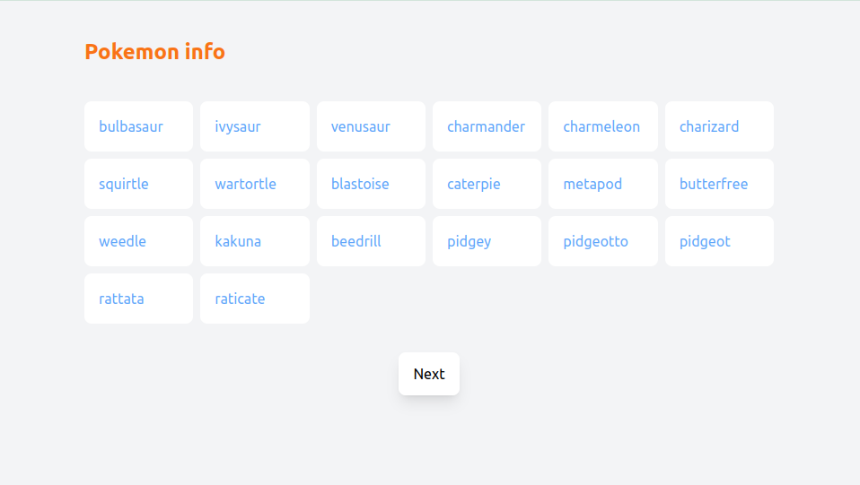
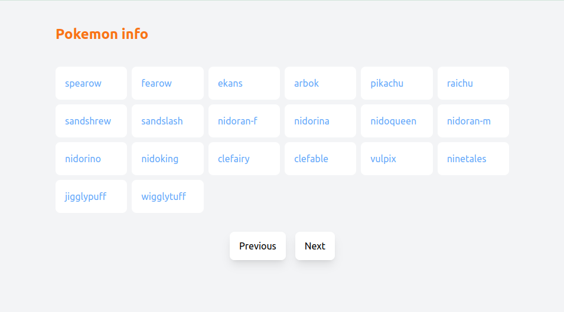
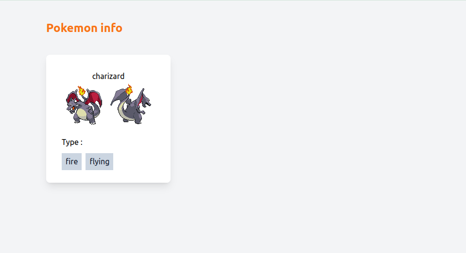

# Pokemon Info

## Screenshoot
### Home

### Detail

## Stack
- React
- React Router DOM
- Tailwindcss

### Resources
[Pokeapi](https://pokeapi.co/docs/v2)

## What I Learn
- Fetchdata from API
- Hooks
- Parse Data with Props
- Grid with tailwindcss
- Custom page with tailwind